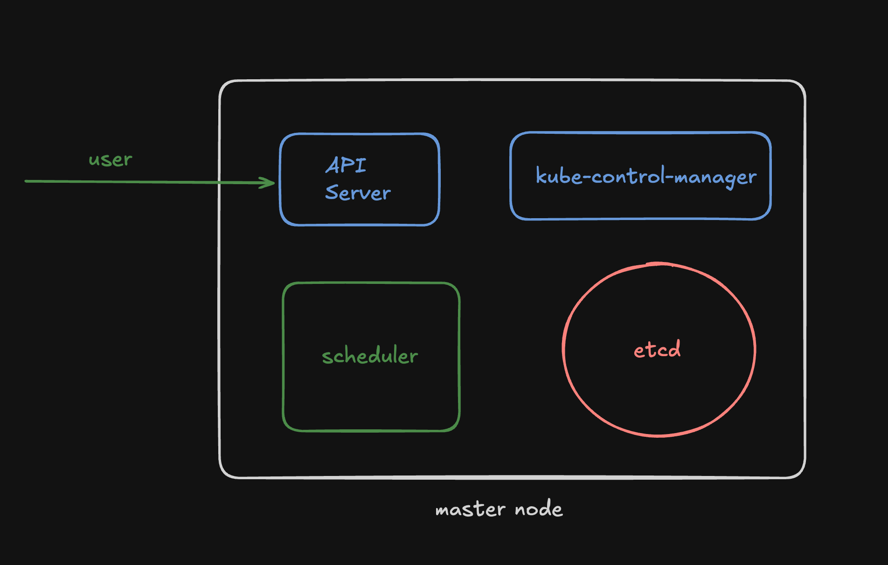

**Kubernetes Tutorial**

Kubernetes is a container orchestrator tool. It helps us
to manage container, so that the developer need not to be worrying about
running, managing containers/services. It reduces the mental overhead of 
the developer for managing containers.

****
## 1. Create a cluster using Kind

Install using
```brew install kind```

### Define a YAML file for creating a cluster

```yaml
kind: Cluster
apiVersion: kind.x-k8s.io/v1alpha4
nodes:
  - role: control-plane  # Master
  - role: worker         # Worker
  - role: worker         # Worker

```
Create the cluster using ```kind```
```
kind create cluster --config create-cluster.yaml --name local
```
```local``` is the cluster name.

Running ```kubectl get nodes``` will return the following.
```
NAME                  STATUS   ROLES           AGE   VERSION
local-control-plane   Ready    control-plane   78s   v1.31.0
local-worker          Ready    <none>          68s   v1.31.0
local-worker2         Ready    <none>          68s   v1.31.0
```

```kind``` stands for kubernetes inside docker. So we can also see 3 docker containers running. Run ```docker ps```.

```
CONTAINER ID   IMAGE                  COMMAND                  CREATED         STATUS         PORTS                       NAMES
6098b484c96e   kindest/node:v1.31.0   "/usr/local/bin/entr…"   3 minutes ago   Up 3 minutes   127.0.0.1:52443->6443/tcp   local-control-plane
b888c3054b03   kindest/node:v1.31.0   "/usr/local/bin/entr…"   3 minutes ago   Up 3 minutes                               local-worker2
9a2f08e37a8b   kindest/node:v1.31.0   "/usr/local/bin/entr…"   3 minutes ago   Up 3 minutes                               local-worker
```

List down all the clusters using, ```kind get clusters```

Delete all the clusters using 
```kind delete clusters --all```


Now we have the nodes running.

## 2. What is kubectl?
kubectl controls the Kubernetes cluster manager. A k8s master node consists of API server, etcd, kube-control-manager, scheduler. User sends HTTP request to API server with correct credentials, API server verifies it and follows user given instructions.



So where are the credentials stored that are needed for sending HTTP request? kubectl gets the credentials from
```~/.kube/config``` file.

```cat cat ~/.kube/config```

## 3. Create pods

Pods contain one or multiple containers. Pods are the smallest unit we can run on a k8s cluster.

Create a YAML,
```yaml
apiVersion: v1
kind: Pod
metadata:
  name: flask-helloworld
spec:
  containers:
  - name: flask-helloworld
    image: digitalocean/flask-helloworld
    ports:
    - containerPort: 5000
```

Apply the config using 
```kubectl apply -f create-pods.yaml```

See the pods running,
```kubectl get pods```

The pod is running as of now. But we only have one pod running. What if we want to always main atleast 3 pods of the helloworld program? No matter what, we want our application to be highly resilient and want to be able to maintain 3 pods NO MATTER WHAT!

This is where a Deployment comes into the picture.

## 4. Create a Deployment

The deployment file looks like this,
```yaml
apiVersion: apps/v1
kind: Deployment
metadata:
  name: flask-helloworld
spec:
  replicas: 3
  selector:
    matchLabels:
      app: helloworld-deployment
  template:
    metadata:
      labels:
        app: helloworld-deployment
    spec:
      containers:
      - name: flask-helloworld-container
        image: digitalocean/flask-helloworld:latest
        ports:
        - containerPort: 5000
```

Once the deployment has been created we will be able to see the below when we get all the pods,
```NAME                                READY   STATUS              RESTARTS   AGE
flask-helloworld                    1/1     Running             0          6m24s
flask-helloworld-587b86cd85-9xnmj   0/1     ContainerCreating   0          14s
flask-helloworld-587b86cd85-j5f2h   0/1     ContainerCreating   0          14s
flask-helloworld-587b86cd85-xmh7s   1/1     Running             0          14s
```

Now these pods are highly resilient. We can try stopping one but it will again recreate another one to make sure we have 3 pods running always! This is done by the ```ReplicaSet```.

Deployments create and manage ReplicaSets, which handle all the Pods for a Deployment. When you perform a rolling update, the Deployment gradually creates Pods in a new ReplicaSet while scaling down the old Pods. It checks if the new Pods are healthy and only proceeds if they pass health checks. If an error occurs during the update, the Deployment can roll back to a previous ReplicaSet. Kubernetes keeps previous ReplicaSets (with zero replicas) for rollback purposes, and a retention policy controls how many revisions are kept.


## 5. How do We expose our containers?

We use ```Services```. 
